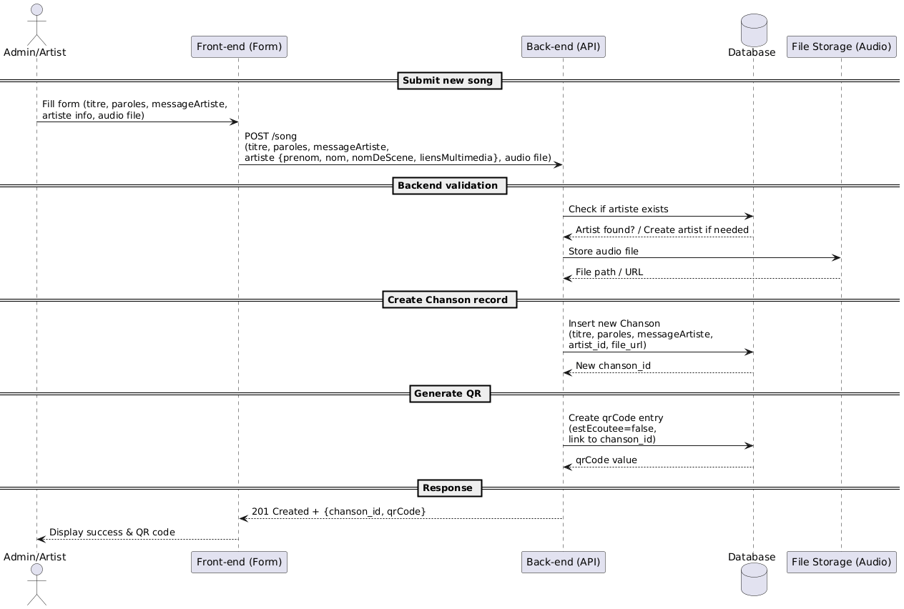
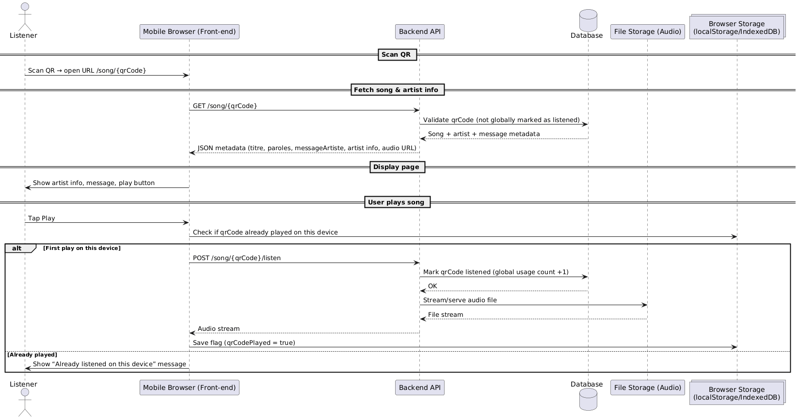

# Impermanent : Atelier de programmation du 28 septembre 2025
Projet web collaboratif explorant les thèmes de l’impermanence dans un contexte d’abondance numérique.

## Objectif
Développer une application prototype pour un doctorant du nouveau département de design de l’ÉTS, dans une réflexion sur notre relation à l’art et à la musique par la technologie.

## Concept
Un CMS minimal qui génère un QR code donnant droit à **une seule écoute** d’une chanson,
avec ses paroles et un message de l’artiste.

- Chaque QR code autorise une écoute par appareil (stockée en local dans le navigateur).
- Le même code peut être scanné par plusieurs personnes, mais chaque écoute reste unique.

## Contexte théorique
Ce projet s’appuie sur les théories critiques des industries culturelles et sur la théorie de la résonance du sociologue allemand Hartmut Rosa :  
<https://en.wikipedia.org/wiki/Resonance_(sociology)>

## Tâches de l’atelier
- Coder le **front-end** et le **back-end**  
- Déployer le tout sur notre infrastructure dans le cluster sandbox: <equipe>-impermanent.sandbox.cedille.club

## Documentation: Frontend & Backend

Les éléments qui suivent sont des suggestions.
Libre à vous de procéder autrement si vous préférez !

### **Architecture**

- Backend

  - API REST (ex. /song pour créer une chanson + QR code).

  - Stockage audio sous forme de fichiers (ex. bucket S3 ou volume persistant) référencés en base de données.

  - Endpoints :

    - `POST /song` : création d’une chanson avec ses infos + QR

    - `GET /song/{qrCode}` : récupération des infos sur la chanson + URL audio

    - *`POST /song/{qrCode}/listen` : enregistre la première écoute (optionnel, si vous souhaitez tracer les lectures côté serveur).*

- Frontend

  - Page qui s’ouvre au scan du QR code, affiche l’artiste, le message et le bouton « Écouter ».
  - Page d'accueil qui permet d'ajouter une chanson et d'afficher un QR code.
  - Vérifie dans localStorage/IndexedDB si l’utilisateur a déjà écouté la chanson sur ce navigateur.

- Guides visuels

  - Les vues à implémenter : [View the PDF](docs/impermanent_views.pdf)
 
  - Modèle de données UML:
    
    

  - Cas utilisation: Un artiste ajoute une chanson pour créer un QR Code
    
    

  - Cas utilisation: Une personne souhaite écouter une chanson en scannant un code qr.
    
    

  > Stockez l’URL du backend dans les variables d’environnement pour faciliter le déploiement. (fichier .env)
  
  > Pour le développement, utilisez des conteneurs Docker (PostgreSQL, etc.) pour vos bases de données.

## Technologies suggérées (si vous n’avez pas de préférence)

- Frontend : [React](https://create-react-app.dev/docs/getting-started/)

- Backend : Node.js (API REST) avec [Express](https://expressjs.com/en/starter/installing.html)

- Base de données : PostgreSQL

Pour le développement, vous pouvez lancer une instance PostgreSQL temporaire avec Docker :

```bash
docker run --name impermanent-dev \
  -e POSTGRES_USER=impermanent-dev \
  -e POSTGRES_PASSWORD=test123 \
  -e POSTGRES_DB=impermanent-dev \
  -p 5432:5432 \
  -v pgdata:/var/lib/postgresql/data \
  -d postgres:16
```

Cela permet de démarrer rapidement une base de données locale sans l’installer directement sur votre machine.

## Documentation: DevOps

Le dossier k8s-template fournit une base de manifestes Kubernetes (Deployment, Service, Ingress).
Adaptez les champs nécessaires et posez vos questions si besoin.

### **CI/CD**

- **CI – Intégration Continue**  
  Intégrer régulièrement du code dans la branche principale, exécuter des tests,
  puis construire et publier l’image Docker sur `ghcr.io`.

- **CD – Déploiement Continu**  
  Déployer l’application à partir de l’image produite.  
  Ici, on applique les manifests Kubernetes avec `kubectl`.

> Pour l’atelier, nous n’utilisons **ni ArgoCD ni Flux** :
> le déploiement se fait manuellement.

### **Procedure pour avoir accès au kubectl**

- Installer Krew dans votre terminal: suivre [les instructions d'installation de
krew](https://krew.sigs.k8s.io/docs/user-guide/setup/install/)

- **Kubelogin**

`kubelogin` est utilisé pour s'authentifier au cluster sandbox pour cet atelier.

Pour installer `kubelogin`, exécuter la commande :


```bash
kubectl krew install oidc-login
```

Pour d'autres options d'installation, voir [le repo de
kubelogin](https://github.com/int128/kubelogin)

- Récupérer le fichier de configuration envoyé par courriel si vous vous êtes inscrit à l'atelier, sinon demander à Alex de vous l'envoyer.

- Modifier dans le fichier k8s-sandbox-config.yaml les deux lignes où vous devez mettre votre courriel étudiant de l'ETS <your-email>.

- Indiquer à kubectl où se situe le fichier de configuration.

Avec Linux/MacOS:

```bash
export KUBECONFIG=~/Downloads/k8s-sandbox-config.yaml #Modifier selon l'emplacement du kubeconfig téléchargé
kubectl get nodes
```

Avec Windows: 

```bash
kubectl oidc-login
$env:KUBECONFIG="C:\Users\<user>\Downloads\k8s-sandbox-config.yaml" #Modifier selon l'emplacement du kubeconfig téléchargé
kubectl get nodes
```

Vous devriez être redirigé vers une page d'authentification de Omni pour vous authentifier.
(Si cela ne vous redirige pas vers une page de connexion dans votre navigateur, vérifier qu'il n'y a pas de fautes de frappe.)

- Dans la page de connexion, cliquer sur Créer un compte Omni.
Saisir le même courriel et un mot de passe.

- Vérifier votre courriel en cliquant sur le lien reçu par email.

- Ensuite, vous pouvez refaire la commande et vous devriez voir ceci :

```bash
kubectl get nodes

#(objectpath '/org/freedesktop/portal/desktop/request/1_192/t',)
#NAME                                 STATUS   ROLES           AGE    VERSION
#k8s-cedille-sandbox-controlplane-0   Ready    control-plane   3d3h   v1.30.0
#k8s-cedille-sandbox-worker-0                Ready    <none>          3d3h   v1.30.0
#k8s-cedille-sandbox-worker-1                Ready    <none>          3d3h   v1.30.0
#k8s-cedille-sandbox-worker-2                Ready    <none>          3d3h   v1.30.0
``` 
